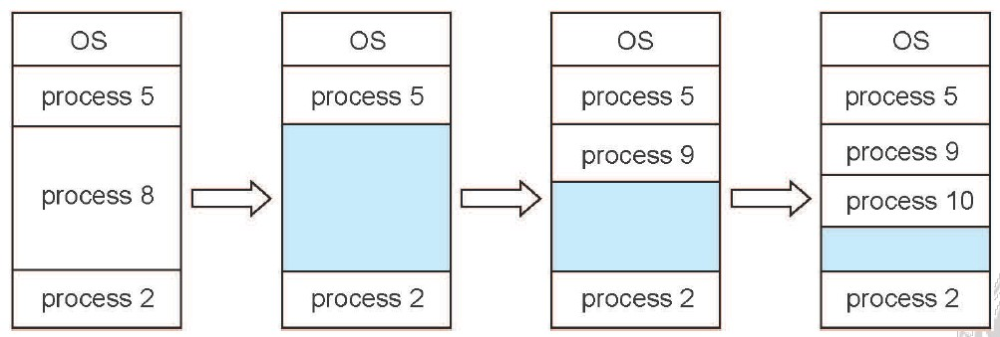
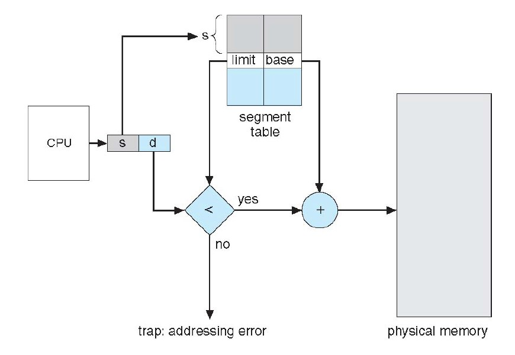
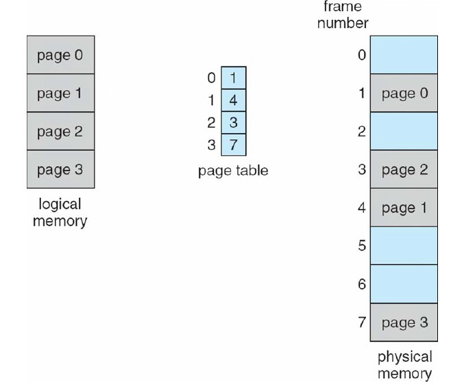
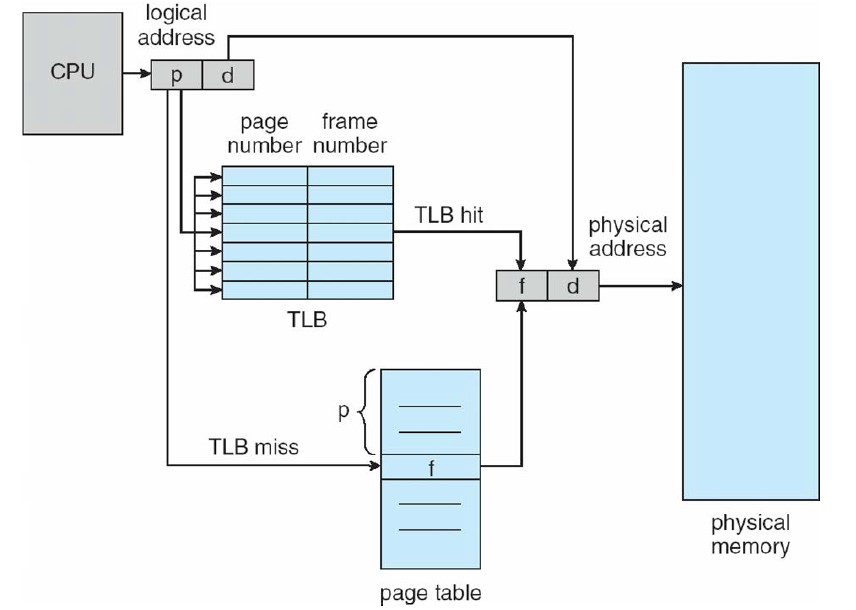
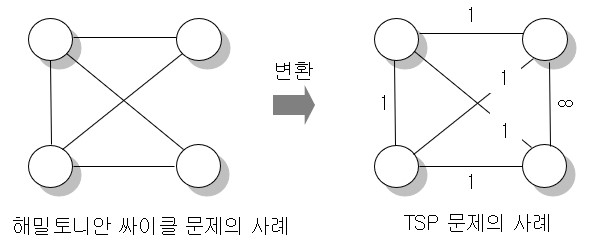
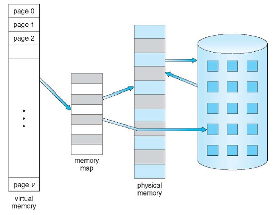
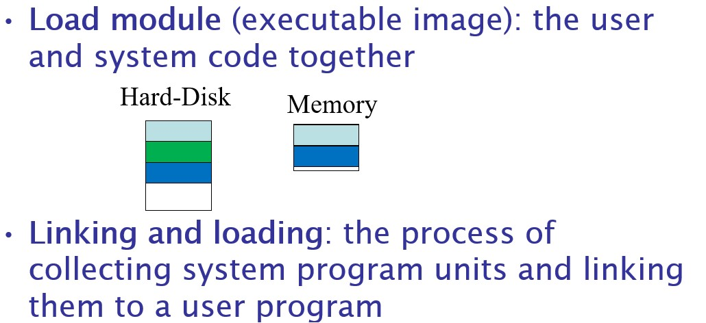
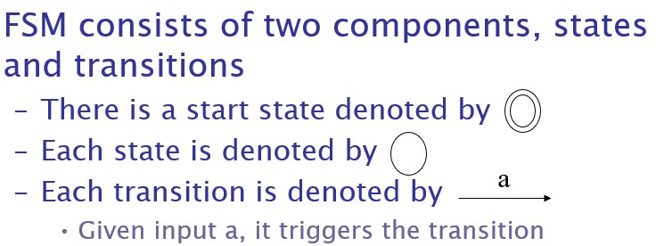
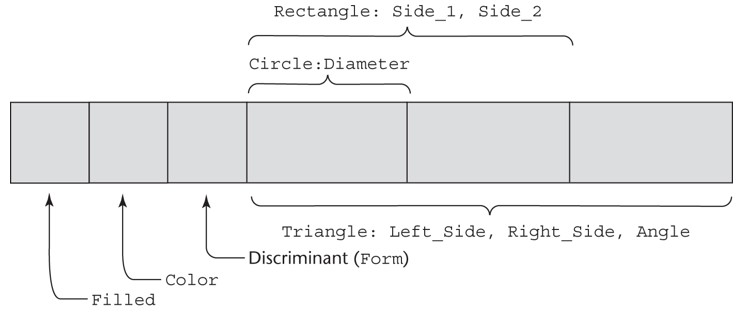
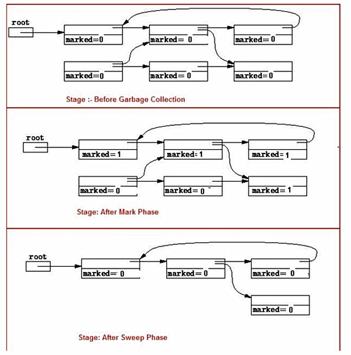

# 📙 Today I Learned  
## 규칙  
* 기억에 남는 내용 기록  
* 1일 2개의 알고리즘 문제 해결  
* markdown으로 작성  
  
---  
[5월](./month/MAY)  
---  
  
## 6월  
* 1日  

컴파일러 LR Parser 구현 중 Follow와 First을 과제의 조건에 맞춰서 변경해보았다. 추가적으로 공백, tap공백, 구분자(||), 생성규칙의 ==> 까지 토큰으로 잘 나눴다.
```
input grammar
E==>E+T
E==>T
T==>T*F||F
F==>(E)
F==>id

file.open("input.txt");
if(file.is_open()) {
	while(!file.eof()) {
   		string str, temp;
   		getline(file,str);
		bool flag = false;
		for (int i=0; i<str.length(); i++) {
			if(str[i] == ' ' || str[i] == '\t' || str[i] == '\v') { // tab exception
				str = str.substr(0,i) + str.substr(i+1);
			}
		}
		for (int i=4; i<str.length(); i++) {
			if(str[i] == 'i' && str[i+1] == 'd') { // id -> i
				str = str.substr(0,i+1) + str.substr(i+2);
			}
			
			else if(str[i] == '|') { // || separator
				temp = str[0];
				temp += "==>" + str.substr(i+2);
				
				str = str.substr(0,i);
				production[cnt++] = str;
				production[cnt++] = temp;
				flag = true;
				break;
			}
		}
		if(!flag) {
			production[cnt++] = str;
		}
	}
}
file.close();
```
탭이나 공백문자가 들어오면 그 부분을 무시하고 다 붙여서 토큰으로 나누었고 구분자가 들어왔을 때는 두 개의 생성규칙처럼 저장했다. ex) T==>T*F||F   --> T==>T*F  와 T==>F로 두 개의 생성 규칙으로 저장하였다.  
그리고 다음 과정으로 넘어가기 위해 SLR Parsing을 공부하는데 생각보다 긴 시간이 걸린다. 다음에는 LR(0) 아이템을 구해서 파싱 테이블을 짜보도록 해야겠다.  

---

* 2日  

알고리즘에서 쓰이는 문자열 검색에 대해 공부했다. [참조](https://otrodevym.tistory.com/entry/%EC%95%8C%EA%B3%A0%EB%A6%AC%EC%A6%98%EB%AC%B8%EC%9E%90%EC%97%B4-%EA%B2%80%EC%83%89%EA%B3%A0%EC%A7%80%EC%8B%9D%ED%95%9C-%EA%B2%80%EC%83%89-%EB%9D%BC%EB%B9%88%EC%B9%B4%ED%94%84-KMP-%EB%B3%B4%EC%9D%B4%EC%96%B4%EB%AC%B4%EC%96%B4)  
1) Native Matching 알고리즘  
2) **Rabin-Karp** 알고리즘  
3) **KMP** 알고리즘  
4) **Boyer-Moore** 알고리즘  

먼저 `Native Matching 알고리즘`은 찾고자하는 문자열과 주어진 문자열을 하나하나 비교하면서 처음부터 끝까지 확인하는 방식이다. 최악의 경우 시간복잡도 O((n-m)m)이 걸린다. 하나하나 일일이 검사하므로 작은 문자열이라면 시도할만 하다. 하지만 대부분이 큰 문자열이 주어지므로 최대한 피하자.  

두번째론 `라빈-카프` 알고리즘이 있다. 이 알고리즘은 해시를 이용하여 해시끼리 비교하는 알고리즘이다. 먼저 찾으려는 문자열의 해시값을 구하고 주어진 문자열에서 찾으려는 문자열의 크기만큼 잡고 해시값을 구해서 비교해가며 찾으면 된다. 하지만 문자열이 매우 커질 수록 충돌이 일어날 가능성이 커진다고 한다. (약 1억자리 이상)  
그리고 반복되며 찾을 때마다 아래처럼 이용하면 된다. 시간복잡도는 평균적으로 O(n+m)이다.  
  

세번째론 `KMP` 알고리즘이 있다. 이 알고리즘은 접두사와 접미사에 대해 알아야한다. 예를 들어서 ABCAB란 문장이 있다하자.  
접두사는 A, AB, ABC, ABCB, ABCBA  
접미사는 B, BA, BAC, BACB, BACBA 이다.  
즉, 앞에서 자르기 시작한 것과 뒤에서 자르기 시작한 것의 차이이다.  
이제 pi라는 배열을 만들어 줄건데 pi란 배열은 접두사와 접미사가 같은 경우를 조건으로 두고 그 단어를 pi라는 배열에 넣는 것이다. 왜냐 불필요한 부분을 넘기고 그 전에 찾을 문자열이 포함되었는지 확인 해야하기 때문이다. 만약, 무작정 인덱스 크기를 잡고 넘기게 되면 그 넘어간 인덱스 중에 찾아야할 문자열의 일부가 있을 수 있기 때문이다. 시간복잡도는 O(n+m)이다.  
```
KMP(A[ ], P[ ]) 
{ 
	preprocessing(P); 
	i  ← 1;  ▷ 본문 문자열 포인터 
	j  ← 1;  ▷ 패턴 문자열 포인터 
	▷ n: 배열 A[ ]의 길이, m: 배열 P[ ]의 길이 
	while (i ≤ n) {                                 
		if (j = 0 or A[i] = P[j]) 
			then { i++;  j++; }           
			else  j ← π [j];
		if (j = m+1) then { 
               	A[i-m]에서 매치되었음을 알림; 
                	j ← π [j];                     
		}  
	} 
} 

preprocessing(P) 
{ 
	i  ← 1;  ▷ 본문 문자열 포인터 
	k  ← 1;  ▷ 패턴 문자열 포인터 
	while (j ≤ m) {                                 
		if (k = 0 or A[j] = P[k]) 
			then { j++;  k++; π [j] ← k; }           
			else  k ← π [k];
		if (j = m+1) then { 
               	A[i-m]에서 매치되었음을 알림; 
                	j ← π [j];                     
		}  
	} 
}
```

마지막으로, `보이어-무어` 알고리즘인데, 이 알고리즘은 이해하기 어렵다. [참조pdf](http://www.cs.jhu.edu/~langmea/resources/lecture_notes/boyer_moore.pdf) 이 곳을 통해 그림으로 이해를 돕고자 한다.
  [보이어-무어 계산](https://personal.utdallas.edu/~besp/demo/John2010/boyer-moore.htm)   
KMP 알고리즘과 비슷한 개념을 가지고 있다. 최대한 많이 건너뛰면서 비교를 하는 것이다. 하지만 다른 알고리즘과 다른 부분은 오른쪽에서 왼쪽으로 문자열을 비교한다. 물론 이동은 왼쪽에서 오른쪽으로 한다. 이 알고리즘이 대부분의 프로그램의 문자열 검색 방법으로 사용되고 있다.  
오른쪽 끝의 문자가 일치 하지 않고 주어진 문자에 찾아야하는 문자가 존재하지 않으면 패턴 길이만큼 이동한다.  
불일치가 발생하면 최대의 효율을 내는 두가지 방법 중 고른다.  
1) 나쁜 문자 이동 (Bad Character Shift)  
2) 착한 접미부 이동 (Good Suffix Shift)  
	- 나쁜 문자 이동은 (나쁜 문자란, 본문 문자 중 패턴과 일치 하지 않은 문자)
		* 패턴의 오른쪽부터 비교해서 불일치 지점 찾기.  
		* 본문의 불일치 지점 문자와 일치하는 패턴의 가장 오른쪽 지점만큼 이동 시킨다.  
	- 착한 접미부 이동은 (착한 접미부란, 본문 문자 중 패턴의 접미부와 일치하는 문자)  
		* 첫번째 경우엔 착한 접미부와 동일한 문자가 왼쪽 문자열중 존재
		* 두번째 경우엔 패턴에 착한 접미부가 없지만 접두부가 이리하는 경우 KMP와 비슷  
  
테이블도 만들어봐야 하나 이해가 상당히 부족하므로, 많은 포스팅을 참고하고 여러 강의자료로 공부가 더 필요하다는 것을 느꼈다.  

---

* 3日  

SLR Parsing Table을 만들기 위한 공부를 계속 이어갔다. 그 중 LR(0) 아이템을 만드는 부분에서 큰 오류가 발생했다. 
I0부터 만들었을 때 정확히 만들어지긴 하나, 그 이상까지 루프가 돌아 오류가 나거나 틀린 답을 뱉어나는 오류이다. 해결하기 위해 하루종일 붙잡았으나, 아직도 해결하지 못했다.  
```
for(int i=0;i<state_count;i++) {
    	characters[20] = {};
        for(int z=0;z<I[i].prod_count;z++) {
            if(!in_array(characters,mark_symbol(I[i].prod[z]))) // mark symbol이 없으면 넣어주기 
        		characters[strlen(characters)] = mark_symbol(I[i].prod[z]);
		}


        for(int j=0;j<strlen(characters);j++){
            goto_state(&I[i],&I[state_count],characters[j]); // characters가 I[i]의 mark symbol이라면 I[i]의 dot을 한칸 옮기고 I[state_count]에 저장 
            closure(&init,&I[state_count]);	//closure 계산 
            int flag=0;
            for(int k=0;k<state_count-1;k++){
                if(same_state(&I[k],&I[state_count])){ // 같은 state를 갖나 
                    cleanup_prods(&I[state_count]); // I[state_count] 초기화 
					flag = 1;
                    cout<<"I"<<i<<" on reading the symbol "<<characters[j]<<" goes to I"<<k<<".\n";
                    goto_table[i][k]=characters[j]; // goto_table에 등록 
                    break;
                }
            }
            if(!flag){ // 같은 state을 갖지 않은 경우 
                //cout<<"I"<<i<<" on reading the symbol "<<characters[j]<<" goes to I"<<state_count<<":\n";
                goto_table[i][state_count]=characters[j]; // goto 테이블 마지막에 추가 
                print_prods(&I[state_count]); // print 
                state_count++;
            }
        }
    }
```
흐름을 파악하고 계속 수정해나갔으나, 무엇이 문제인지 찾았으면 좋겠다. 😩😩  

---

* 4日  

OS 수업 중 Main Memory에 대해 공부를 하였다.  
메모리에 프로세스를 할당할 때, 메모리를 관리하는 내용이라고 볼 수 있다.  
  
처음에는 메모리에 연속되게 할당을 하였으나, 여러가지 이슈가 생기면서 새로운 방법을 찾아갔다.  
Memory Management에 두 가지 Focus에 맞춰서 볼 예정이다.  
1) Utilization : 물리 메모리를 얼마나 아껴쓰는지  
	- `Fragmentation`  
		+ *External Fragmentation* : 필요한 메모리만큼 비어있는 메모리가 존재하나, 연속적이지 않은 경우  
		+ *Internal Fragmentation* : 필요한 메모리보다 더 많은 메모리를 할당하고 남은 부분을 사용하지 않은 경우  
2) Performance : 메모리 접근 속도가 얼마나 빠른지  
	- Address translation (logical to physical), swapping  
		+ `Swapping` : Memory -> Disk, Disk -> Memory로 적합한 순서로 재배열하는 기법이다.  
  


메모리 관리 기법 또한, 두 가지로 나눠서 볼 수 있다.  
1) Segmentation  
2) Paging  

*Segment*란 우리가 프로그래밍을 할 때 사용되는 여러가지 논리적 단위로, 예를 들어 `main program` `procedure` `function` `method` 등을 말할 수 있다. 교수님께서는 의미있는 조각이라고 말하셔서 꽤 직관적으로 이해가 되었다.  
Segmentation은 논리적주소로 이루어진 2개의 tuple로 구성되어 있다고 할 수 있는데 그 모양은 이렇다.  
`<segment-number,offset>` segment-number에는 adress space 즉 주소공간을 의미하고 offset은 논리적 주소로 보았을 때 위치를 말한다.  
또, Segment table을 갖는데 `base`와 `limit`을 갖게 된다 base는 물리메모리상에서 시작하는 주소고 limit은 segment의 길이라고 생각하면 된다. 예를 들어 [segment-number][2] 이러한 Segment table이 있다면 [0][0] -> limit, [0][1] -> base를 뜻한다.  
  
구체적인 Segmentation의 모양을 그림으로 나타낸 것이다.  
또 하나의 특징은 Segmentation은 프로그래머가 직접 정하므로 OS의 컨트롤 밖에 위치한다. 그래서 이러한 부분을 다 고려해서 코딩을 하는 프로그래머는 거의 없다고 하셨다.  

Focus를 맞췄던 Utilization과 Performance에 대해 이야기해보자.  
먼저 Utilization은 이전에 Contiguous보다는 좋아졌다. 왜냐 segment단위로 나누게 되어 external Fragmentation이 좋아졌기 때문이다. 하지만 Performance의 측면에서는 낮아졌다. Address translation의 측면에서는 Segmentation 하드웨어를 보면 메모리 주소에 두번 접근하기 때문이다. 이러한 Trade-off을 갖는데 어떻게 보면 Swapping에 입장에서 보면 이미 할당된 메모리를 segment단위로 나눠서 자리를 재배열해 다른 메모리가 할당하도록 자리를 내주게 되면 훨씬 속도가 빠른 경우도 있지만 그것은 특정한 경우에만 가능하다.  

그 다음으론 *Paging*이다. Paging은 모든 메모리 공간을 page 단위로 쪼갠다고 생각하면 된다. 바로 Utilization과 Performance에 대한 결과를 보고 그 이유에 대해 알아보자.  
page단위로 쪼개기 때문에 external Fragmentation은 아예 일어나지 않고 internal Fragmentation 또한 최소화 할 수 있다. 따라서 Utilization은 향상한다. 하지만 Segmentation과 같이 Performance에서는 Address translation은 떨어지고 Swapping은 좀 더 좋아 질 수 있다.  
  
Paging의 논리적인 모델을 살펴보면 이러하다. 논리 메모리에서 page table을 거쳐 물리메모리로 매칭되는 방식이다.  
  
Paging의 하드웨어를 그림으로 보여주고 있다. 이 그림과 같이 PTBR(Page-table base register)에 Page table이 존재해서 CPU가 Memory에 두 번 접근한다. 먼저 page table에 접근 후 물리 메모리에 접근을 한다. 그리고 Segment에는 limit이 존재했으나, Page에는 limit이 존재하지 않는다.  
또 Free Frames에 대해 적어보면 이 List는 OS가 가지고 운영하며, 밑에 사진과 같다.  
  
할당 해제시에는 `Free-Frame list` 아무데나 넣어준다. 왜냐하면 물리 메모리는 어느 곳에 어떻게 접근해도 성능과 특성이 같기 때문이다.  
Swapping에 대해 잠깐 얘기하면 `Page-in`, `Page-out`에 대해 얘기하면  
	+ Page in : Disk로 내려갔던 Page 하나를 물리 메모리 공간에 할당한다.  
	+ Page out : 물리 메모리 공간 확보를 위해 Page Frame하나를 Disk에 Swap한다.  
Page 하나의 사이즈는 4KB이며,  32bit OS에서 한 프로세스의 Page table의 크기는 4MB이다. Page Table을 그림으로 보았을 때 저렇게 생겼었지만 제대로 확인하게 되면 아래와 같다.  
  

오늘은 절반만 공부했으나 다음에 전부 공부해볼 생각이다.  

---

* 6日  

하루를 쉬고 다시 공부를 시작하였다. 오늘은 저번에 공부했던 OS시간에서의 Memory에 대해 더 공부하였다.  
주로 공부한 부분은 `TLB`와 `Hierarchical Page Tables`이다. 어려운 개념이면서도 중요하니 다시 기록을 해볼려고 한다.  
두 개념 다 `Paging`기법에서 문제점을 해결하기 위해 사용한다. 먼저 TLb는 Address Translation으로 인한 속도 저하 문제 즉, Performance 측면에서 해결하기 위해 사용되고, Hierarchical Page Tables는 Utilization 측면에서 Page table의 크기가 너무 커지는 문제를 해결하기 위해 사용된다.  
먼저 TLB에 대해 알아보면, Translation Look-aside Buffers의 약자로 Cache의 일종으로 생각하면 이해하기 좋다. Paging에서의 Frame number와 Page number을 쌍으로 저장하여 Cache와 같은 역할을 하는 버퍼이다. Parallel Search을 하게 되어 도잇에 Page number, Frame number 쌍에 동시에 다 접근해서 원하는 Page Number을 통해 Frame Number을 접근하는데 이때, 어떤 number에 접근해도 O(1)으로 시간복잡도가 일정하다. 예전에 공부했던 Context Switch에서의 Overhead중 하나인 TLB Flush가 여기서 일어나게 되는데 프로세스 A의 Page, Frame number 쌍을 저장해놨다가 프로세스 B로 Context Switch한 경우 버퍼를 다 비우고 다시 채우게 된다. Cache 개념으로 처음에 채워지는 쌍들은 모두 Miss이기 때문에 Overhead가 따르게 된다.  이 부분을 생각해서 `Tagged TLB`개념이 나오는데 이 개념은 PID와 비슷한 ASID를 TLB에 둬서 각각의 숫자쌍이 어떤 프로세스의 것인지 표기하는 것이다. 이때는 TLB Flush을 하지 않아서 A -> B -> A로 Context Switch 되었을 때 버퍼에 A의 것이 하나라도 남아있다면 Hit을 해서 속도를 올리겠다는 개념이다. 하지만 버퍼에 공간을 하나 추가한다는 것은 돈이 많이 들어 사용하지 않는다고 하였다.  
이러한 문제를 배우고 다른 특징을 또 배웠는데 그것은 Locality 즉 지역성이다. for loop에 의해서 계속 메모리를 참조하게 되면 근처 지역에서 벗어나지 않고 비슷한 공간을 계속 참조하는 특성을 가지고 있다. 따라서 Hit확률이 거의 90%라고 할 수 있다고 한다. 이러한 특징때문에 TLB는 아직도 사용하고 있으므로 중요하다고 한다. 다음으론 그림으로 설명을 도운다.  
  
이러한 추상도를 그릴 수 있다. TLB는 MMU에 붙어있는 장치인데, 위 그림에서 TLB Hit되어 물리메모리의 접근하는 부분이 MMU의 역할이라고 볼 수 있다. 따라서 Hit가 이뤄질 경우 MMU안에서 다 해결이 된다는 말로 속도가 빠르다. 그리고 위에서 말한 것과 같이 TLB에 동시에 접근하는 것을 볼 수 있다. 중요한 것은 TLB miss와 TLB에 동시에 접근해서 TLB에 있으면 miss 부분을 버리고 TLB에 없으면 바로 miss부분에 진입해서 물리메모리에 접근한다는 것이 중요하다고 강조하셨다.  
Effective Access Time(EAT) = TLB access time + Hit case + Miss case (α = hit ratio, t = Access time for TLB, m = Access time for memory)  
= t + α * m + 2 * m * (1-α)  이때의 2는 Page table과 Memory에 접근하는 시간이다.  
contiguous했을 때 100ns로 접근한다고 했을 때 Paging에서 Hit ratio가 매우 높다면 메모리 접근을 아무리 많이해도 Overhead가 크게 차이가 나지 않아서 Paging을 비로서 사용할 수 있다. 메모리 접근을 많이 해도 상관없다는게 포인트로, 다음에 설명할 Hierarchical Page Tables와 연관이 깊다.  
여러가지 Page table의 구조가 있는데 Page 각각의 사이즈가 4KB로 Entry을 다 고려하면 4MB의 공간을 잡아 먹게 된다. 이 용량을 줄이기 위해  
- Hierarchical Paging  
- Hashed Page Tables  
- Inverted Page Tables  

이렇게 세 가지가 있으나 Hierarchical Paging을 제외하고는 단점이 존재해서 중심으로 다룰 것은 Hierarchical Paging이다.  
개념은 Page Table들을 Paging해서 차지하는 공간을 드라마틱하게 줄인다는 것이다. 바로 수업에서 이해한 그림을 보게되면  
  
과정들을 다 생략하고 이해한 그림이다. Logical Address Space에서 0x0000 0000 중 0x0000 0|000으로 나뉘어서 앞의 5개는 Page number, 뒤에 3개는 Offset을 의미한다. 0x0000 0000은 Page Table의 0번의 0으로 indexing하여 접근하게 된다. Level 1의 Page table은 4KB을 차지하고 Frame number로 5000, 5001, 5002을 가지고 있다. 이 Frame number는 물리 주소공간에서 마지막에 연속적이지 않은 Page Table을 구성할 때 사용된다. 그리고 또 4 KB이므로 level 2로 연결 될 때 인덱싱해온 주소에 맞춰서 1024을 곱해서 찾아간다. Level 2에서는 마찬가지로 주어진 Number로 물리 주소공간에 연결을 한다.  
이렇게 다 연결하고 보면 이전에는 4MB를 차지한 반면에 지금은 고작 3 + 3 + 1 page로 7page로 완성을 하였다. 드라마틱하게 공간이 줄어든 것을 볼 수 있었다.  

공부한 부분 중 핵심을 꼽은 것은 다 정리했으나, 이제 자잘한 부분은 넘어갔으니 짚고 넘어가보자.  
Page table에 Valid bit을 둬서 Frame number가 값이 어떤 것이 들어있을 때 이 값의 유효성을 체크해준다. v와 i로 valid와 invalid를 체크해주며 valid할 때만 접근을 허용한다.  

Share Pages은 프로세스끼리 같은 물리 주소공간에 접근할 수 있게 같은 frame, page number 쌍을 갖게 하는 것이다. 이 때 프로세스 별로 접근권한을 둬서 권한 밖의 행동을 하게 되면 MMU가 제지하고 종료시키도록 할 수 있다.  

아까 그냥 넘긴 Hashed와 Inverted Page Table에 대해 짧게 말해보면 Hashed는 똑같이 Hashing 기법을 통해서 접근하게 만드는 것이다. 단점으로는 원하는 테이블을 찾기 위해서 값을 계속 연결되어 찾아가야한다는 점이 있다. 이걸 개선하기 위해 page을 더 두게 되면 위에서 한 Hierarchical Paging와 같게된다. Inverted은 말 그대로 Page number -> Frame number얻어 오던 Paging에서 반대로 Frame number -> Page number을 얻게 하는 방식이다. 이 방식은 pid을 두고 찾을 수 있으나, 선형탐색을 통해서 인덱싱을 해야하므로 Overhead가 분명하게 존재한다. 따라서 이러한 방법들은 잘 사용되지 않는다.  


OS외에 공부한 부분은 PL강의에서 들은 Closure와 Coroutines이다.  
`Closure`은 Subprogram과 referencing environment 둘 다 부르는 말로 쓰인다고 하였다. 와닿지 않은 말이지만 예제를 통해서 보여주셨다. JavaScript에서의 Closure는 
```
function makeAdder(x) {
	return function (y) { return x + y ;}
}
...
var add10 = makeAdder(10);
var add5 = makeAdder(5);
document.write("add 10 to 20: " + add10(20) + "<br />");
document.write("add 5 to 20: " + add5(20) + "<br />");
```
을 통해서 `function (y) { return x + y ;}`이 Closure인 지 알게 되었다.  

`Coroutine`은 그림으로 보면 확실히 이해가 되었다. quasi-concurrent execution으로 quasi 동시 실행 이라고 하는데 자세히는 모르겠다. 이 Coroutine을 Call하는 것은 `resume`이라고 부른다.  
  

PL수업은 지금까지 배워온 프로그램밍 언어들을 왜 그렇게 써왔는가에 대해 배우는 것 같고 모르는 언어들의 특성들을 배우는 것을 재밌게 듣고 있다. 다른 수업들에 비해 부담감이 적어서 그런거 일지 모르겠지만 내용 정리와 이해가 잘 되고 있어서 좋다.  

---

* 7日  

오늘은 주말이라, 문제로 풀어보는 알고리즘 (파란색) 책을 읽어보고 공부를 하였다. 다른 전공 공부로 힘들었던 몇 주간을 쉬어주기 위해 천천히 읽어보았다. 초반엔 아는 내용이 나와서 제대로 숙지되었는가 생각하며 읽어가는 도중 기억에 남기고 싶은 내용들을 적어볼려고 한다.  

**수분할**은 자연수 n을 순서에 상관 없이 하나 이상의 자연수의 합으로 나타내는 방법이다. 그 중 일반적인 방법으로는 n/m 수분할이다. 이 방법은 n을 m이하의 자연수로만 나타내는 방법이다. 예를 들어  5/2 수분할은  
```
1+1+1+1+1  
2+1+1+1  
2+2+1  
```
이렇게 된다. 이러한 n/m 수분할은 재귀적으로 생각할 수 있는데, 재귀적으로 생각하게 된다면 5/2 수분할에서 `1+` 와 `2+`로 시작하는 부분 두 가지로 나눌 수 있다.  
```
1) 1로 시작   
1+1+1+1+1

2) 2로 시작
2+1+1+1  
2+2+1  
```
`1+` 뒤에 나오는 `1+1+1+1`은 4/1 수분할과 같고, `2+`뒤에 나오는 `1+1+1, 2+1`은 3/2 수분할의 두가지 이다. 따라서 이끌어낼 수 있는 점화식은 아래와 같다.  
```
partition(0,m) = 1
if n>0 then, partition(n,m) = ∑(i=1 ~ m) partition(n-i,i)
```
이러한 내용을 토대로 C언어로 함수를 작성하면,  

```
int partition(int n, int m) {
	int cnt = 0, i;
	if (n < m) m=n;
	if (n == 0) return 1;
	for (i=1; i<=m; i++)
		cnt += partition(n-i, i);
	return cnt;
}
```
이러한 함수가 만들어진다. 하지만 중복계산이 계속 생겨서 효율적이지 못한 코드가 된다. 이 함수를 메모이제이션을 이용해서 바꾸어보자.  

```
#define MAX 200
int memo[MAX][MAX];
int partition(int n, int m) {
	int cnt = 0, i;
	if (n < m) m=n;
	if (memo[n][m] > 0) return memo[n][m];
	if (n == 0) return memo[n][m] = 1;
	for (i=1; i<=m; i++)
		cnt += partition(n-i, i);
	return memo[n][m] = cnt;
}
```
memo 배열에서 값이 0이라면 값이 계산된 적이 없기에 함수를 실행하고 그외의 다른 값이라면 도중에 해당 memo값을 반환해준다. 이러한 호출 구조는 그대로이며, 조금만 추가하면 중복 계산을 없앨 수 있다.  

수분할에 덧셈의 순서를 구분하게 되는 코드도 가볍게 보았다.  
```
int partition2(int n) {
	int cnt = 0, i;
	for (i=1; i<n; i++)
		cnt += partition2(n-i);
	return cnt + 1;
}
```

책을 통해서 짧게 읽고 이해한 부분을 정리해보았다. 문제는 BOJ을 통해서 풀어볼려고 한다.  

---  

* 8日  

오늘은 컴파일러 과제를 집중적으로 했다. 전부 하진 못하더라도 SLR Table까지는 구현할려고 한다. 그 와중에 컴파일러와 상관은 없지만, c언어와 c++언어의 차이를 느꼈다. 같은 c로 짠 코드이지만 확장자가 c인 경우와 cpp인 경우가 메모리 참조가 다른다는 것을 알게 되었다.  
.c일 때는 오류 없이 잘 진행되는 코드도 .cpp로 고치자마자 오류가 생겼다. 그 오류들은 메모리 참조부분에서 많이 일어났는데, 대부분 런타임 때 결정되는 변수들을 가지고 배열을 정적할당하지 말라는 경고와 오류들이었다.  
```
1)
int first[n_nt][n_t];
memset(first, 0, n_nt*n_t*sizeof(int));
```
```
2)
int **first = new int*[n_nt];
for (int i=0; i<n_nt; i++) {
	first[i] = new int[n_t];
	memset(first, 0, n_t*sizeof(int));
}
```
나는 당연하게 `1)`이 아닌 `2)`처럼 동적할당을 해줘야 런타임에 결정되는 크기를 제대로 할당해줄 수 있다고 생각하여 `2)`와 같이 짰는데 도중에 프로그램이 멈추고 종료되는 현상이 일어나서 `1)`코드로 임시로 해놨었다. 그 이후 컴파일하니 컴파일러의 경고와 함께 원하는 답은 출력이 되었다.  

이제 SLR table을 다 만들고 어서 운영체제로 넘어가야겠다.

---

* 9日  

SLR table을 C로 구현한 뒤 문자열을 위해 C++로 바꾸는 작업 중에 의문이 들었다. C++에서 사용하는 String 헤더와 C에서 사용하는 string.h 헤더간에 원하는 문자를 찾고 인덱스를 반환해주는 함수가 String 헤더에서는 find(), string.h 헤더에서는 strchr() 혹은 strstr()이다.  
```
ptr1 = strchr(I[l].rh[i],'.'); 
t1 = ptr1 - I[l].rh[i];
```
이런식으로 주소끼리 연산해서 인덱스를 찾을 수 있어서 사용했다.   
```
t1 = I[l].rh[j].find(temp2);
```
하지만 find함수를 사용해서 전체적인 subprogram을 완성하고 컴파일해보니 원하는 답이 안 나오고 있다.  

원하는 문자의 주소를 찾고 문자열의 0번째 인덱스 주소를 빼면 그 사이의 데이터 갯수를 알 수 있다고 알고 있다.  
그리고 find 함수는 문자열에서 제일 처음으로 나타난 찾고자하는 문자의 인덱스를 반환해준다.  
두 부분의 차이가 있어 subprogram이 오작동하는가에 대해 하루종일 공부했다.😡  

---

* 11日  

어제 계속 컴파일러 SLR파싱 오류를 찾느라 시간 보내버렸다. 😥  
오늘은 이번 주 강의를 들어, 정리할려고 한다.  
알고리즘에서 **NP-완비 이론**을 공부했다.  
현실적인 시간으로 풀 수 있는 문제들은 n의 다항식으로 표시되는 시간복잡도를 가진 문제들을 `P`문제라고한다. 이때의 P는 Polynominal의 P이다.  
이외의 비다항식 시간 즉 현실적인 시간으로 풀 수 없는 문제들의 예로는  

- 지수시간 (2ⁿ)  
- 계승시간 (n!)  

**Yes/No** 문제  
ex) 그래프 G에서 길이가 k이하인 해밀토니안 경로가 존재하는가?  
**최적화** 문제  
ex) 그래프 G에서 길이가 가장 짧은 해밀토니안 경로는 얼마인가?  
이 두문제는 동전의 앞뒷면문제와 같다. YES/NO문제로 최적화 문제를 해결할 수 있다.  

이러한 내용을 알고 NP-완비 이론에 차차 접근해보자.   

- YES/NO의 대답을 요구하는 문제에 국한 (최적화 문제와 밀접한 관계 가짐)  
- 문제를 현실적인 시간에 풀 수 있는가  
- 거대한 군을 이룸  

현재까지 연구결과로 어떤 문제가 NP-완비라면 현실적인 시간에 풀 수 없다. 허나, 아직 증명이 되지 못했다.  

**다항식 시간 변환**(Polynominal Time Reduction)은 문제 A의 사례 α를 문제 B의 사례β가 있을 때 아래의 성질을 만족해야하며, α≤ｐβ로 표기한다.  
1) 변환은 다항식 시간에 이루어진다.  
2) 두 사례의 답은 일치한다.  

알고리즘은 아래 사진과 같다.  
  

1) 문제 A를 다항식 시간에 문제 B로 변환한다.  
2) 변환된 문제 B를 푼다.  
3) 문제 B의 대답이 Yes이면 Yes, No이면 No를 반환한다.  


**P**와 **NP**  

**P** : Deterministic Turing Machine에서 **Polynomial Time**에 풀리는 문제  

**NP** : Non-Polynomial이 아닌, Nondeterminisitic Turing Machine에서 **Polynomial Time**에 풀리는 문제, Yes라는 해가 나왔을 때 다항식 시간에 확인할 수 있으면 NP (병렬 처리가 가능하다고 한다.)  
성질 P ⊂ NP은 자명하다.

**NP-완비/하드**  
**NP-하드** : 모든 NP문제가 NP-하드로 다항식 시간에 변환가능하다.  
**NP-완비**(complete) : NP-완비는 NP이며, NP-하드이다.  
+ NP-하드 ⊂ NP-완비  

예를 들어 이러한 예시가 있을 때
  
알려진 임의의 NP-하드 문제 A로부터 문제 L로 다항식 시간에 변환가능하면 문제 L도 NP-하드이다.  

**NP-하드의 증명**  
해밀토니안 싸이클(그래프의 모든 정점을 단 한번씩 방문하고 돌아오는 경로)문제가 NP-하드임을 알고 있을 때 TSP(Traveling Salesman Problem)문제도 NP-하드임을 보인다.  
  
`해밀토니안 싸이클을 갖는다 ⇔ 길이가 정점n 이하인 해밀토니안 싸이클을 갖는다.`  
따라서 TSP는 NP-하드이다.  

NP-완비 문제의 예  
- 최단 경로  
	- 그래프의 정점 s에서 t로 가는 최단 경로는 간단히 구할 수 있다.
- 최장경로
	- 그래프의 정점 s에서 t로 가는 최장경로는 간단히 구할 수 없다.
	- NP-완비

두 문제의 난이도는 차이가 엄청나다.  
*최장경로 문제* : 주어진 그래프에서 정점 s에서 t로가는 길이 k 이상인 단순경로가 존재하는가?  
*두 점 사이 해밀토니안 경로 문제* : 주어진 그래프에서 정점 s에서 t에 이르는 해밀토니안 경로가 존재하는가? (NP-완비)  
해밀토니안 경로 문제를 이용해서 최장경로 문제를 해결해보자.  
  
두 점 s와 t사이에 해밀토니안 경로를 갖는다 ⇔ 두 점 s와 t 사이에 길이가 4인 단순경로를 갖는다.  
따라서 최장경로 문제는 NP-하드다.  

어떤 문제가 NP-완비/하드로 확인되면  
- 쉬운 알고리즘을 찾으려는 헛된 노력 중지
- 주어진 시간 예산 내에서 최대한 좋은 해를 찾는 알고리즘(휴리스틱) 개발에 집중한다. (대부분 Greedy 알고리즘 이용)  

포함관계  
P ⊂ NP (O)  
NP ⊂ P (?) 아직까지 밝혀진 바가 없다.  

   
지금까지 나온 내용 들의 포함관계는 이러하다.  

---

* 12日  

드디어 SLR Parsing Table을 완성하고 이제 운영체제를 공부하기 시작했다.  

**Virtual Memory**  
프로그램에서 필요한 메모리를 논리적 주소 공간에서 물리적 주소 공간으로 접근을 한다. 예전에는 논리적 주소 공간과 물리적 주소 공간의 크기를 같게 해야 프로그램이 꺼지지 않고 실행이 되었다. 가상 메모리가 도입 되고나서는 가상 메모리 공간에 물리 메모리 공간에서 조금만 가지고 유지하며, 논리적 주소 공간에서 요구 할 때 가상 메모리 공간에 없다면 물리 메모리 공간에 접근해서 가져온다.

  
그림과 같이 되어있을 때 맨 오른쪽 원통을 `Storage`라고 한다. Storage에 들어가는 메모리들은  
1) 기존 프로그램 이미지에 있는 경우  
2) SWAP영역(변경한 데이터 혹은 동적 할당한 데이터)에 있는 경우  

또한 데이터 부분 Code Data Heap Stack들을 가상메모리로 유지중이다.  

**Demand Paging**  
프로세스가 해당 페이지를 접근 하는 순간에 Paging해서 제공하는 것이다.  

  
Valid-Invalid Bit를 두고 운용한다. 실제로 Frame을 할당한 경우 Valid, 안한 경우에는 Invalid로 저장해놓은다. 이 때 Invalid한 Frame에 접근한 경우 `Page Fault`가 일어나게 된다.  

 
위 사진과 같이 Invalid한 프레임에 접근하게 되면 Page Fault가 일어난다.  

**Page Fault**  
  
1) CPU에서 요청한 메모리에 접근할 때 MMU가 Page table에서 Valid, Invalid을 체크한다.  
2) Invalid일 때 Trap(SoftWare Interrupt)가 일어나게 된다. [대표적인 Software Interrput인 Page Fault] 이 때 System Call 처리한 것과 같이 User mode라면 Kernel mode로 변경하고 Page Fault Handler를 찾는다.  
3) Page Fault Handler가 Free Framelist에서 연산에 맞게 빈 공간이나 맞는 공간을 찾아서 해당 Page table에 넣어주고 Valid bit을 Valid로 바꿔 준다.  
4) Restart Instruction을 해서 오류가 안나게 실행해준다.  

만약, Frame이 부족할 때 Page Fault Handling이 실패한다. 이것이 **Out Of Memory**(OOM)이다.  

이러한 내용이 일반적으로 진행되었을 때의 얘기이다.

이제는 예외에 대해 얘기해보자.  
똑같이 `2.`까지 진행했을 때, Free Frame가 부족한 경우  
다른 Frame으로부터 Page을 가져오는 기법을 `Page Replacement`라고 한다. 이어서 Frame을 얻어 왔을 때 맞는 공간을 찾아야한다. 그 공간을 찾는 것을 두 가지로 나눌 수 있다.
1) Program image에서 가져온다.  
2) `Storage`(Swap)에서 찾아온다. 그것을 `Swap-in`이라고 한다. 
이 부분이 위 그림의 설명으로 생각하면 좋다. 다음에는 위의 과정인 `3.`에서 Valid bit부터 이어가면 된다.  

추가적으로 Page Replacement나 Storage Access가 일어날 때 성능 저하가 일어난다. Storage Access는 Virtual Memory가 설계 될 때 무조건 한번은 일어난다고 가정하고 설계된 것이다. 하지만 Page Table에서 기존의 Frame을 사용할려 할때 기존의 데이터를 Swap영역에 저장할 때 1번 접근하고, Instruction에서 Storage에 접근할 때 2번 접근하게 되어 성능저하가 일어난다. 결국 Storage 접근이 성능을 좌지우지하게 된다.  

*Performance of Demand Paging*  
이전에 알아보았던 EAT(Effective Access Time)을 적용해볼 것이다. 이때 Page Fault Rate을 p라고 했을 때 무조건 일어날 경우 p=1, 안 일어날 경우 p=0으로 성능 차이를 알아보자.  
- 무조건 안 일어난 경우 : EAT = (1-p) x Memory access
- 무조건 일어난 경우 : EAT = Memory access + p x (page fault overhead + swap page out + swap page in)  

식을 정리하고 예를 들어보자.  
Memory access time = 200ns  
Average page-fault service time = 8ms  
EAT = (1-p) x 200 + p (8ms)  = 200 + p x 7,999,800  
만약 p = 0.001, 0.1% 확률로 일어난다고 했을 때는 EAT = 8.2um이 나온다. p = 0과 비교해보면 약 40배나 느리다고 볼 수 있다.  
같은 식으로 성능 저하를 10%이하로 잡기 위해서는 400,000 메모리 접근마다 한번 page fault가 일어나야 성능 저하가 10% 이하일 수 있다.  

**Page Replacement**  
위에서 한 내용으로 Page Replacement는 대략적으로 이해가 되었다. 이제 Page Replacement의 알고리즘에 대해 공부했다.  

먼저, FIFO 알고리즘이다.  
  
FIFO는 15번 Page Fault가 일어났다.  
그림에서는 Frame을 3개만 할당했다. 직관적으로 Frame이 늘어나면 Page Fault가 줄어든다. 
하지만 잘못 관리하면 늘어나게 되는데 이 부분을
`Belady's Anomarly`라고 한다.  

  
가장 이상적인 알고리즘은 앞으로의 미래를 예측해서 가장 늦게 쓰일 프레임을 대체하는 것이다. 하지만 우리는 미래를 예측할 수 없어서 이상적인 알고리즘으로만 남았다. 이 때는 9번 Page Fault가 일어났다.  

  
현실적으로 접근해서 Least Recently Used 알고리즘으로 생각해보자. 
전에 배운 LRU을 이용하는 거와 같다.  
이 때는 12번 Page Fault가 일어났다. FIFO보다는 적지만 이상적인 알고리즘보다는 많이 일어났다.  

하지만 이러한 LRU도 구현하는데에 있어 문제가 있어 `LRU Approximation Algorithms`라는 것을 사용한다.  

**LRU Approximation Algorithms**은   
page에 Frame이 있으며, Valid-Invalid bit 옆에 `Reference bit`을 둬서 사용한다. 밑에서 이야기할 `Modify bit` 또한 옆에 같이 둔다.  
Reference bit은 초기에 0으로 두고 page가 reference될 때 bit을 1로 설정한다.  

이러한 알고리즘을 이용한 방법이 **Second-Chance Algorithm**다. 순환큐를 통해서 page들을 계속 순환하는데 reference bit가 1인 경우 0으로 바꿔주고 0인 경우 해당 page을 빼서 다른 페이지로 대체한다. 한 페이지가 계속 reference 된다면 bit가 0에서 1로 바뀌기 때문에 다음 사이클에서도 대체되지 않을 것이다.  

이 알고리즘에서 더 나아가면 **Enhanced Second-Chance Algorithm**이 있다. 이 알고리즘은 Second-Chance에서 Reference bit외에 Modify bit을 두는 것이다. modify bit은 dirty bit과 같으며, Swap 영역에서 Swap-in으로 page에 frame이 넘어왔을 때 이 값이 변경되었는가 확인하는 비트이다. 이 비트가 1이라면 page replacement 되기 전에 Swap-out으로 Swap 영역에 값을 업데이트 해주고 replacement 되어야한다.  
해당 알고리즘을 썼을 때 대체되는 우선 순위는  
(reference, modify)일 때
1) (0, 0) 
2) (0, 1)
3) (1, 0)
4) (1, 1)

이렇게 정리된다.  

오늘의 내용을 정리해보자면, `Page Falut` 일 때 frame이 없으면 `Page replacement`해야하는데 Page replacement Algorithm에 따라 Page Fault 발생할 확률이 다르고 심지어는 Belady's Anormaly가 일어날 만큼 큰 영향을 준다.  
가장 이상적인(Optimal) 알고리즘은 미래에 가장 늦게 선택되는 Page를 대체하는 것인데 미래는 예측하기 어려워 LRU 알고리즘을 사용한다.  
LRU방식은 과거를 보고 미래를 예측하는 방법인데 실제로 아주 빠른 시스템에서는 구현이 불가능해서 `LRU Approximation Algorithm`을 사용한다.  
reference bit을 사용하는 것이 `Second-Chance algorithm`이며, 거기서 reference와 modify비트를 사용하는게 `Enhanced Second-Chance` 알고리즘이다.

Demand paging을 제대로 사용할려면 Page fault가 적게 일어나야한다. 우리가 할 수 있는 일은  
1) 메모리 많이꽂는다.  
2) 효율적으로 replacement 알고리즘을 수행한다.  

두 가지를 달성해야 Demand Paging을 높은 성능으로 돌아갈 수 있다.

--- 

* 13日  

오늘은 운영체제 과제를 시작한 날이다. 운영체제 이번 과제는 CPU 스케쥴러를 새롭게 만들고 적용해보는 것이다. 거기에 부가적으로 LKM(Load Kernel Module)을 사용하여 커널 컴파일을 최소화 시켜서 구현하는 것을 설명해주시고 구현하게 되었다. LKM과 커널사이에서 모듈이 적재되었는지 확인하는 방법을 여러방면에서 공부하고 찾아보는데 빨리 답이 나오지 않았다.  
몇 시간 동안 고민한 결과 커널에 변수 하나를 두고 이번에 과제를 하면서 공부하게 된 EXPORT_SYMBOL로 LKM에서 extern 변수로 받게 되었다. LKM에서 변수를 조작해서 init과 exit할 때 변수를 바꿔서 모듈이 적재가 되었는지 확인 하도록 했다.  
외에도 Makefile을 통해서 리눅스 환경에서 컴파일 과정을 여러번 하지 않고 한번에 명령어를 통해 할 수 있는 것을 공부하며, 모듈을 컴파일 해내는 것도 가볍게 공부했다. 하지만 현재 커널을 수정하고 컴파일하는 과정에서 여러가지 오류가 일어나 디버깅하는데 시간이 꽤나 지체되고 있다.  
정리하면 커널을 매번 컴파일하며 소요되는 시간을 줄여주기 위해 LKM이라는 모듈을 도입해 모듈을 적재하거나 빼서 커널코드처럼 사용할 수 있는 방법과 평소에 코딩하면서 사용하지 않고 다른 코드를 리뷰할 때나 볼 수 있었던 extern 변수들이 어떻게 이용되고 다른 소스코드로 보내기 위해서 EXPORT_SYMBOL을 사용해야 한다는 것을 공부할 수 있었다. 그리고 Makefile을 통해서 리눅스 환경에서 여러가지 과정을 생략한 컴파일을 통해서 조금 더 간편하게 컴파일을 할 수 있다는 것을 공부했다.  

---

* 14日  

프로그래밍언어론 복습  

- 1강 Preliminaries  

**언어를 평가하는 요소**  
1) Readability (주관적일 수 있다)  
	- simplicity
	- orthogonality
	- data type
2) Writability (주관적일 수 있다)
	- simplicity
	- orthogonality
	- support for abstraction
3) Reliability (ex. type error) Writability와 반비례
	- type checking (C언어는 type unsafety)
	- exception handling (C언어 제공x, c++ java 제공)
	- aliasing ( ex) 포인터)
4) Cost  
	- 교육비용
	- 작성비용
	- 컴파일비용
	- 실행비용
	- 유지보수비용 등
5) Others
	- Portability
	- Generality

**언어 설계에 영향을 주는 2가지 정리**
- 하드웨어
- 당시대 사람들의 Needs  
	- 50-60년대 간단한 프로그램
	- 60년대 fortran
	- 70년대 프로세스지향, 데이터지향적 프로그래밍 (자료 추상화)
	- 80년대 중반 객체지향 프로그래밍 (자료 추상화 + 상속 + 다형성)  

**구현 방법**
- 컴파일
	- 프로그램을 기계어로 번역한다. 속도↑ 개발↓
- 인터프리터 방식
	- 인터프리터를 통해 번역한다. 속도↓ 개발↑
- 하이브리드 방식
	- 컴파일러와 인터프리터 타협 ex) Java  

**컴파일**  
고급언어 -> 저급언어  
속도↑ 개발↓ (Slow Translation, Fast execution)  
어휘분석은 토큰으로 나눠서 분석
구문분석은 토큰들을 파스트리로 변환해서 분석  

  
맨 윗칸이 Load Module로 exe와 같은 실행가능한 이미지들이다. 모듈이 메모리상에 프로그램을 순서대로 올려준다.  

컴파일 순서  
컴파일-링킹-로딩-실행  
c - obj - exe - procese 등록  

메모리 영역  
- code
- data
- heap
- stack  

폰 노이만의 병목현상(bottleneck)  
연결 속도보다 instruction이 빠르게 되면 일어난다. 컴퓨터의 속도 한계 주요원인이다.  
cpu와 메모리 사이에는 cache가 존재해서 극복한다.  

**인터프리터**  
기계어 번역x  
실행속도 느림 (컴파일보다 10~100배 느림)  
가끔 더 많은 공간 요구  
지금까지 고급언어로는 적게 사용됨  

과정
소스 + 입력 데이터 -> 인터프리터 -> 결과  
- 메모리多 속도↓  

**하이브리드**  
컴파일러와 인터프리터 사이  
고급언어 -> 중간언어 (해석이 쉬움)  
인터프리터보단 빠름  
초기 JAVA가 하이브리드  

추가적으로, Just-in-Time Implementation Sysmtems  
하이브리드와 같이 중간언어 사용  
처음 호출에는 하이브리드 중간언어 사용  
두번째 이후 호출에서는 컴파일 기계언어 사용  

요약 :  
- 프로그래밍 언어 평가요소 4가지
	- 가독성
	- 쓰기가능성
	- 신뢰성
	- 비용  
- 언어 설계 영향 요인
	- 하드웨어
	- 사람들의 니즈
- 프로그래밍 언어 해석 방법 3가지
	- 컴파일
	- 인터프리팅
	- 하이브리드  

---  

* 15日  

프로그램언어론  

- 3강 Describing Syntax and Semantics  

**구문과 의미**  
- 구문 (syntax) : form 모양
- 의미 (Semantics) : 표현의 의미  

**Syntax**
lexeme : 가장 하위의 구문 단위, 최소단위  
token : lexeme의 범주, 종류  


**BNF && CFG**  
CFG (Context - Free - Grammar)  
- 문맥자유언어 클래스 정의
- 자연어 문법 기술함  

BNF (Backus - Naur Form)  
- 문맥 자유 문법에 속함
- 구문 변수 = 논터미널
- lexeme or token = 터미널

left hand side, right hand side  
-> 기준으로 왼쪽, 오른쪽

시작 심볼은 문법의 논터미널  

**Rules**(->)  
RHS 한개 이상  
재귀적으로 기술 가능  
시작 심볼에서 시작 후 끝은 무조건 **터미널 심볼**로 끝나도록 **유도**(=>)되어야한다.  

문장은 Sentential form  
터미널심볼은 Sentence  

Leftmost derivation  
맨 왼쪽 논터미널심볼 가장먼저 유도(확장)

파스트리 : 계층적으로 유도를 표현함  

**Ambiguous**   
하나의 문장에서 두개 이상의 파스트리 생성  


Unambiguous   expression grammar  
파스트리에 연산자의 **우선순위**를 주어줌  

연산자의 Associativity  
연산자가 동일한 우선순위을 가져 Ambiguous가 생기는 경우 left associativity, right associativity로 나눠서 왼쪽부터 or 오른족부터  

**★ambiguous 해결★**
1) 우선순위 부여  
2) 우선순위 같은 경우 associativity 부여  

`<expr> -> <expr> + <expr> | const` (ambiguous) 
`<expr> -> <expr> + const | const` (unambiguous)  

*Extended BNF*  
BNF ≒ Extended BNF  
**표현력은 같음**  
Optional []  
Alternative ()  
Repetitions {}  

요약 :  
BNF와 CFG는 표현이 같다.  


- 4강  Lexical and Syntax Analysis

Regular grammar (정규 문법)은 Regular Expression (정규 표현)으로 표현 된다.  
정규표현은 **Finite-state-Machines** (유한상태기계, FSM)으로 이행된다.  
Context-free Grammar (문맥 자유문법)은 BNF와 표현할 수 있는 것이 같다.  
BNF는 push-down automata로 이행된다.

  
FSM은 C언어의 enum으로 구현가능  


- 5강 Names, Bindings, and Scopes  

명령형언어는 폰노이만 아키텍쳐를 추상한다.  
- 명령과 데이터는 메모리에 저장된다.  
- cpu에 의해서 필요한 연산이 실행된다.  

명령형의 언어 피연산자를 담당하는 memory cell이 variables(변수)다.  

**변수의 여러 속성**
- Name  
변수의 이름, 함수의 이름, 매개변수 이름, 구조체  
Identifier와 상호호환되게 사용  

	- Length  
		- 자유도 증가  
		- 컴파일타임 ↓  
		∵ Symbol table에 넣음
		- 메모리 ↑  
		∵ 런타임에 기록시 실행시간 ↓와 함께
	- Form  
		- underscore (`_`)을 대체해서 Camel notation 사용  
		ScoreValue instead of score_value  
		- PHP  
		`$` 로 변수 선언  
		e.g. $scoreValue  
		- Perl  
		Scalar $  
		Array @  
		Hash %  
		변수 선언 
	- Case sensitivity  
		- C기반 언어는 대소문자 구별한다. 이것은 가독성을 떨어트린다고 하는데 사람마다 다르다.  
	- Special words  
		- 가독성을 높일 수 있지만 Reserved word(예약어)가 지정되있는 경우 피해야한다.  
		- 예약어가 많으면 유저가 예약어를 피해서 변수를 써야하지만 부족하다면 불편하다.  
	
- Variables  
	변수는 memory cell을 매핑한것이다.  
	특성 : name, address, value, type, lifetime, scope  

	- Name  
		앞에서 정리한 것과 같다.  

	- Address  
		- C Pointer와 같이 변수와 연관된 메모리의 주소이다.  
		- 변수가 함수 속에서 다른 주소를 가질 수 있다. (10강에서 계속)
		- L-value(변수의 주소)와 같다.  
		- Alias : 같은 주소에 다른 이름 (C 포인터 C++ 참조자) 가독성 저하  


	- Type
		- 변수 값의 범위와 어떤 연산을 쓸지 결정한다.  

	- Value
		- *Abstract memory cell* : 물리적 cell 이나 변수와 연관된 cell  
		- l-value : address  
		- r-value : value  
		
	- **Binding**  
		권한과 속성 사이의 연관이다.  
		- 변수의 type과 value, operation과 symbol  
		binding time에 따라 static과 dynamic으로 나뉘어진다.  
		Language design time, implementation time, compile time은 static binding time  
		따라서, static binding은 
			1) 런타임 전
			2) 프로그램 실행 중 바뀌지 않으면  
		
		Load time과 Runtime, global은 dynamic binding time 은 dynamic binding time으로,  
		1) 실행중에 처음 발생하거나  
		2) 프로그램 실행 중에 바뀔 수 있으면
		dynamic binding이다.  

		Type Binding은 변수가 프로그램에 참조되기전에 자료형이 바운딩되어야한다. 만약 static binding인 경우 explicit 혹은 implicit 선언이 있어야한다.  

		Static Type Binding  
		- 명시적 선언  
			- 프로그래머가 직접 명시해서 선언하는 경우
		- 묵시적 선언  
			- 컴파일러가 자동으로 타입을 찾아내는 묵시적 선언
			- default convention  
			지정하지 않으면 자동으로 default에 들어감
				1) naming convention  
			Fotran에서 사용, 타이핑시에 잘못 치는 경우 잘못된 자료형이 바인딩되어 에러가 일어날 수 있다.   
				2) Using context  
				타입을 추론하는 방식 ex) var 타입 초기화 값을 보고 추정함 (컴파일 시간에 결정되므로 static)  
		
		Dynamic Type Binding  
		바인딩된 자료형 외의 다른 자료형으로 바뀌는 경우 (주소와 메모리셀이 바뀔 수 있음)

		장점 : 프로그래밍 유연성 ↑  
		type명시로 인한 재사용률 ↑  
		단점 : 신뢰성 ↓  
		변수들이 런타임에 새로운 자료형을 가질 수 있어서 메모리 ↑  
		타입체크를 해야하므로 속도 ↓

* 16日  

프로그램언어론 이어서  
- Lifetime  
	- 어떤 메모리 셀에 바운딩되냐에 따라 다르다.  
	- static (data)  
		- 실행 전 메모리 셀에 바운딩
		- 실행 이후에 값 바뀌지 않음.
		- 재귀x
	- dynamic (heap, stack) 
		- stack-dynamic (stack)  
			- 재귀 허용
			- 할당과 해지시의 오버헤드 존재
			- Subprogram이 history senstive하지 않다.
			- 비효율적인 참조(간접 주소)
		- explicit heap-dynamic(heap) 명시적 동적할당
			- 자료형은 컴파일 시간에 바운드 되지만 메모리에 적재는 런타임에 일어난다.  
			- new delete  
			- 동적으로 저장공간관리  
			- 복잡하거나 어렵다.
		- implicit head-dynamic(heap) 컴파일러가 할당 및 해제
			- 선언된 자료형과 다른 자료형으로 할당이 가능하다.
			- 높은 유연성
			- 런타임 오버헤드
			- 컴파일러가 오류 탐색기능 손실
			
- Scope  
	scope란 쓰이고 읽히는 범위  
	지역변수는 선언된 프로그램 유닛의 한정된다.

	- nonlocal 변수  
		- 전역변수
	- Scope rules  
		- nonlocal 변수에 대해서만 적용됨
	
	- Static Scope  
	사람이나 컴파일러가 실행 전에 소스만 보고 알 수 있으면 Static한 변수

		- **subprogram can be nested**
	subprogram 중첩 가능
	속도 ↓

		- subprogram cannot be nested  
	subprogram 중첩 불가능
	속도 ↑ (C기반언어)

	```
	func big() {
		func sub1() {
			var x = 7;
			sub2();
		}
		func sub2() {
			var y = x; // x nonlocal 변수 (static scope일 때는 big의 x)
		}
		var x = 3;
		sub1();
	}
	```
	big에 의해서 sub1에 `x`가 가려진 걸 `hidden` or `closer`변수라고 한다.

- Block
	```
	void sub() {
		int count;
		while(...) {
			int count;
			count++;
			...
		}
	}
	```
	C와 C++에서는 허용하나, JAVA와 C#은 허용하지 않는다. 속도면에서는 좋지 않다. 할당과 해지 반복을 한다.

	함수형 언어는 `let`키워드로 블록을 구성한다.  
	Scheme
	```
	(LET (
		(top (+ a b))
		(bottom (- c d))/ top bottom)
	)
	```
	ML
	```
	let
		val top = a + b
		val bottom = c -d
	in
		top / bottom
	end
	```
	추가적으로 함수언어는 매번 변수를 만들어서 사용한다.


	Blcok의 Scope는 선언부터 Block 끝까지  

- Global Scope
	블록 밖에서 전역변수로 정의되면 어디서든 사용할 수 있다.  
	C언어에서는 오직 한번만 정의해야한다.
	extern으로 다른 파일에서 특정한 변수를 받아와서 사용하는 것도 전역변수로 사용할 수 있다.

	PHP의 경우에 전역변수를 사용할 때는 global로 선언하거나 $GLOBALS로 사용해야한다.

	Python 또한, 전역변수와 지역변수가 이름이 같은 경우에는 명시적으로 global로 선언해주어야한다.
	
- Dynamic Scope  
	non-local 변수에 대해서는 실행시간에 콜체인을 따라가서 호출한 caller를 확인해야한다.

- **Scope 정리**  

```
func big() {
	func sub1() {
		var x = 7;
		sub2();
	}
	func sub2() {
		var y = x;
	}
	var x = 3;
	sub1();
}
```
Static Scoping인 경우엔 sub2의 x를 big의 x를 참조한다.  
Dynamic Scoping인 경우엔 sub2의 x를 sub1의 x를 참조한다.  

Dynamic Scoping
	- 장점 : 편리함
	- 단점 : 구현 힘듬, 정적인 타입체크가 불가능, 가독성 저하

Scope와 Lifetime은 관련이 있지만 다른 개념이다. 

- *referencing environment* : statement에서 보이는 모든 이름의 집합체  
	- static-scoped : 콜스택 전체
	- dynamic-scoped : 콜체인

*active* : subprogram이 콜 후 리턴 전  

- Named Constants  
상수들은 처음에 한번 값을 바운딩해주고 계속 사용된다.  
가독성과 변경하는데 용이하다는 장점이 있다.  
Ada, C++, JAVA는 동적으로 바운딩  
C#은 readonly(동적으로 바운딩), const(컴파일 시간에 바운딩) 두개 사용  
	- 초기화 :  
		static : 제한O  
		dynamic : 제한X

---

* 17日  

프로그램언어론  

- **6강 Data Types**  

1) **표현**
2) **연산**  

자료형은 2가지를 고려해야한다. 이 부분을 생각하면서 공부하자  

Data type : 데이터의 모음과 미리 정의된 연산들의 모음  

descriptor : 변수의 속성들의 모음  
  
모든 속성들은 정적이라서 컴파일 시간까지만 필요하다.(Symbol table에 유지) 따라서 런타임에는 value만 유지한다.  

object : 상속을 제외한 추상 데이터  

- Primitive data types  
가장 기본적인 data type  
비트마다 하드웨어에 기반해서 data type을 정함  

- Structured data types  
primitive data type들을 구조화 시킨 data type  

Numeric types
- integer  
음의 정수 표현  
	- Sign-magnitude notation (MSB가 부호비트)  
	산술문제가 존재 (0011 (3) + 1011 (-3) ≠ 0)  
	- Two's complement notation  
	보수 취하고 1을 더함  
	대부분 사용함
	- One's complement notation  
	0을 표현하는 방법이 2가지가 있음 (1111, 0000)  

- floating point  
표현방법  
	 - Fixed-point notation  
	 1.3  
	 0001 | 0011  
	 0.03 같은 숫자 표현 불가
	 - Floating-point notation  
	 0.13 x 10¹  
	 0111 | 0001  
	 이러한 원리로 작동한다.  
	 0.03 = 0.3 x 10^(-1)도 같이 표현할 수 있다.  

- complex  
	real + imaginary  

- decimal  
	C언어에서 제공 X  
	은행에서 많이 사용함 (COBOL)  
	BCD : 0,1로 코딩된 십진법을 사용함  
	4bit or 8bit 사용  
	ex) 123  
	4 bit : 0001 0010 0011  
	8 bit : 00000001 00000010 00000011  
	장점 : 정확성  
	단점 : 범위 한계, 메모리 낭비  

- boolean  
	true or false  
	byte 단위로 표현 (bit로 하면 연산시 복잡함)  
	장점 : 가독성  

- character  
	숫자 -> 문자 매핑
	ASCII 이용  
	영어 외의 언어 Unicode  

primitive data type  

==============================================  
structured data type  

- string
	- issue  
	primitive로 볼지, char형의 배열로 볼지  
	string의 길이를 정적으로 할지 동적으로 할지 (hi -> hello, hello -> hi)  

	- operation  
	assignment and copying: 주소를 공유 or 값만 복사  

	comparison 
	catenation  
	substring  
	pattern matching(Perl)  

	C, C++ Not primitive  
	Library of function  
	E.g) char str[] = "apples";  
	strcpy(dest, src)  만약 primitive라면 자동으로 사이즈가 늘어나서 복사된다.  

	Java primitive  
	Perl, JavaScript, Ruby, and PHP  
	pattern matching에 정규표현(regular expressions) 사용한다.  
	E.g `/[A-Za-z][A-Za-z\d]+/`  
	E.g `/\d+\.?\d*|\.\d+/`  
	`+` : 1개 이상 나옴  
	`*` : 0개 이상 나옴  
	`?` : optional  
	`\.` : 숫자 .  
	`|` : or  

	Length option  
	static or dynamic  
	- static 속도↑ 편의성↑
		COBOL, Java's String class  
		Compile-time descriptor가 필요하다.
	- Limited Dynamic Length  
		C and C-style C++  
		\0을 주는 것보다 길이를 크게 할당  
		run-time descriptor가 필요 할 수 있으나 static과 비슷해서 필요 없을 때가 많다.   
	- Dynamic (no maximum)   속도↓ 공간↓
		SNOBOL4, Perl, JavaScript, standard C++ library  
		run-time descriptor가 필요하다.  
		할당과 해제에 큰 구현문제가 있다.


- Enumeration type  
	C#의 enum  
	
	Design issues  
	enum 이름이 겹치는 경우 

	장점 : 가독성 증가, 신뢰성 증가(컴파일러 체크 가능, 연산 불가)

	Reliability vs Writeability  
	```
	1) Reliability
	days nextDay(days d) {
		int i = d;
		i++;
		if(i == 7) i = 0;
		return (days)i;
	}

	2) Writeability
	days nextDay(days d) {
		if (d == mon)
			return tue;
		else if(d == tue)
			return wed;
			...
	}
	```
	`1)`(정수로 변환이 가능한 경우)과 같이 코딩하면 유저가 실수 할 수 있다. 코드가 쉬워지며 가독성이 떨어진다.  
	`2)`(변환 불가)은 코딩이 길어지고 실수가 적어진다.  

- Array Types  
	**homogeneous aggregate(같은 종류의 집합체)** of data elements  

	C 계열, Java에서는 배열과 원소의 자료형은 같아야한다.  
	하지만, Javascript, Python, Ruby에서는 typeless reference라는 자료형을 넣게되면 다른 자료형의 포인터를 가질 수 있다.

	- indexing (subscripting)  
	인덱스를 넣으면 해당 원소를 매핑해준다.  
	Fortran과 Ada는 () 사용 (함수 사용과 혼동 가능)  
	나머지는 [] 사용  
	index와 element 자료형이 다를 수 있다.  
	do not specify range checking :  
	C, C++ Perl, and Fortan 속도↑  
	Perl은 array는 `@`을 붙여서 선언, `$`을 붙이고 인덱싱하여 접근  
	인덱싱값이 음수인 경우에는 오른쪽 끝에서 절댓값만큼 인덱싱하면 된다. 그리고 배열에 값이 없을 때 `undef`을 참조시키며 오류를 보고하지 않는다.  

	- Static array  
	장점 : 효율성  
	단점 : 메모리  
	- Fixed stack-dynamic array  
	단점 : 속도(할당 & 해지)
	- Fixed heap-dynamic array  
	장점 : 유연성  
	- Heap-dynamic array (subscript range가 dynamic하다)  
	장점 : 유연성  
	단점 : 속도(할당 & 해지)  
	  
	Fixed는 생성시에 사이즈가 고정된다. Heap-dynamic을 제외하고 나머지 3가지는 subscript range가 스토리지에 할당 이후 lifetime 내내 바운딩 되어있다.  

	- Array categories  
	JavaScript 배열은 연속적이지 않아도 된다. C언어를 예를 들면 배열이 연속적이여야 하나, JavaScript같은 경우에는 0~9, 50 총 배열의 길이는 11이나, 인덱싱이 자유롭다. 인덱스가 없는 곳을 참조할 경우 `undefined`가 반환된다.  
	Python, Ruby, Lua는 배열끼리 붙이거나 원소를 집어 넣을 때만 배열 크기가 증가한다.  

	- Array Initialization  
	C, C++, C#, Java는  
	```
	int list [] = {4, 5, 7, 83};
	```  
	배열의 길이를 컴파일러가 계산해준다.  
	C와 C++은 
	문자형 배열 즉 문자열도  
	```
	char name [] = "freddie";
	```  
	자동으로 크기를 8을 할당해준다. (null-character)  
	```
	char *name [] = {"Bob", "Jake", "Joe"};
	```  
	Java는 String을 기본 타입으로 인정하기 때문에
	```
	String* [] names = {"Bob", "Jake", "Joe"};
	```  
	로 해야한다.  

	- Operations  
	대부분 할당, 비교, 배열끼리 붙이기, slice을 제공하지만 C언어는 아무것도 제공하지 않는다.  

	- 다차원 배열의 모양  
		- Rectangular : row와 column의 수가 같다.(C#)  
		E.g `myArray[3,7]`  
		- Jagged : row와 column의 수가 다르다. (C, C++, C#, JAVA)  
		E.g `myArray[3][4]`  배열의 배열로 정의

	- Slice  
		새로운 자료형이 아닌 정의된 배열의 부분배열이다.  
		ex) Python  
		```
		vector = [2, 4, 6, 8, 10, 12, 14, 16]
		mat = [ [1,2,3], [4,5,6], [7,8,9] ]
		```
		vector[3:6]이라고 작성 인덱스 3부터 6번 이전까지 즉, [3,6)과 같은 개념이다. C++ string 라이브러리의 substr와 비슷하다.  
		mat[1] => [4,5,6]  
		mat[0][0:2] => [1,2]  
		vector[0:7:2] => [2,6,10,14]  
		이차원 배열인 경우는 해당 row을 반환하거나 row가 지정된 경우엔 column을 반환하면 된다.  
		마지막 slice는 인덱스 0부터 시작해서 인덱스 7까지 idx+=2 해서 반환한다.  

	- 배열들의 주소 찾기  
	1차원 배열인 경우  
	address(list[k]) = address (list[lower_bound]) + ((k-lower_bound) * element_size)  
	2차원 배열인 경우  
	Location (a[i,j]) = address of a [row_lb,col_lb] + (((i - row_lb) * n) + (j -col_lb)) * element_size  
		- Row major  
		Row 부터 채워감 (대부분의 언어)
		- Column major  
		Column부터 채워감 (FORTRAN)  

	- Associative Arrays (Dictional)  
	순서가 없는 집합, 인덱싱을 key-value로 되는 배열  

	ex) Perl  
	array `@`로 선언 `$`로 접근  
	Associative Array `%`로 선언 `$`로 접근  
	e.g) %hi_temps = ("Mon" => 77, "Tue" => 79, "Wed" => 65, ...);
	$hi_temps{"Wed"} = 83;
	delete $hi_temps{"Tue"};  

- Record Types  
	**heterogeneous aggregate(다른 종류의 집합체)**  
	C언어에서 Struct  
	배열에서는 인덱스를 숫자로했지만 레코드에서는 이름으로 접근한다.  

	레코드에서 dot(.)을 이용해서 접근한다.  

- Tuple Types  
	레코드와 비슷하나, 이름을 사용하지 않고 배열과 같이 순서대로 인덱싱한다.  

	함수가 여러 값을 반환할 때 사용하기 좋다.  

	ex) Python  
	myTuple = (3, 5.8, 'apple')  
	string과 같이 +으로 다른 튜플끼리 붙일 수 있다.  

	ML  
	var myTuple = (3, 5.8, 'apple');  

	#1(myTuple)로 첫번째 원소에 접근 할 수 있다. 그리고 새로운 튜플타입을 선언할 수 있다.  
	type intReal = int * real;

	F#  
	let tup = (3, 5, 7)  
	let a, b, c = tup  

	Tuple이 없는 C언어  
	```
	1)
	typedef struct _TwoValue {
		int intVal;
		float floatVal;
	} TWO_VALUE;
	
	TWO_VALUE f() {
		TWO_VALUE v;
		
		return v;
	}
	int main() {
		TWO_VALUE t;
		...
		t = f();
	}

	2)
	void f(int *ip, float *fp) {
		...

		*ip = 3;
		*fp = 1.2f;
	}
	int main() {
		int i;
		float f;

		f(&i,&f);
	}

	// Tuple을 지원하는 C언어

	tuple f() {
		...
		return (3, 1.2f);
	}
	int main() {
		tuple t;
		...
		t=f();
	}
	```
	Tuple을 지원하지 않는다면 상당히 번거로워지고 C언어에서는 여러 반환값을 포인터를 이용해서 처리하고 있다. 하지만 가독성이 안 좋아서 Tuple을 사용할 수 있다면 좋다.  


- List Types
	LISP와 Scheme  
	`,`가 없이 사용한다.  
	(A B C D) (A (B C) D)  
	함수를 호출하는 경우와 똑같기 때문에 	`(A B C D) 구분한다.  

	Operation
	Car List 첫번째 원소  
	Cdr List 첫번째 원소 제외한 원소들  
	Cons List끼리 통합한다.  
	
	ML  
	Cons을 `::`로 대체해서 사용한다.  
	3 :: [5, 7, 9] == Cons `3, (5, 7, 9)  
	CAR과 CDR이 hd와 tl로 대체  

	F# ≒ ML  

	Python  
	원소들의 타입이 달라도 된다.  
	myList = [3, 5.8, "grape"]  
	`x = myList[1]` x = 5.8  
	`del myList[1]` 가능하며 이후에는 인덱스가 하나씩 땅겨짐  

	**Comprehensions**  
	[x * x for x in range(6) if x % 3 == 0]  
	range(6) creates [0, 1, 2, 3, 4, 5, 6]  
	∴ 나오는 리스트는 [0, 9, 36] x = 0 3 6  
	
- Unions Types  
	여러개의 타입이 하나의 공간을 공유하는 형태  
	공간은 개체중에서 가장 큰 사이즈가 해당 Union의 공간이다.  
	메모리가 부족할 때는 많이 사용했으나, 지금은 많이 사용하지 않는다.  

	Discriminated  
	Type을 명시해서 사용하는 Union (Ada)  
	Free Union  
	Type checking을 하지않는 Union (C, C++, FORTRAN)  

	```
	Ada Union
	type Shape (Circle, Triangle, Rectangle);
	type Colors is (Red, Green, Blue);
	type Figure (Form: Shape) is record
		Filed: Boolean;
		Color: Colors;
		case Form is
			when Circle => Diameter: Float;
			when Triangle => Leftsid, Rightside: Integer;
			Angle: Float;
			when Rectangle => Side1, Side2: Integer;
		end case;
	end record;
	```
	  
	각각의 상황에 따라 메모리가 할당되는게 다르다.  

	Java나 C#에서는 union을 지원하지 않는다.  
	Free union은 안전하지 않지만 빠르다. (자료형검사 X)
	Ada의 Descriminated union은 안전하지만 속도가 느리다.  

- Pointer and Reference Types  
	Pointer랑 달리 Reference는 초기화가 필요하다.  
	
	- Pointer Operation  
	1) assignment(할당)
	2) dereference(역참조 : 값 읽어오기)  
	
	dereference는 implicit(묵시적), explicit(명시적) 가능함  

	```
	int a = 10;
	int *p;
	int &b = a;

	p = &a;
	a = 20;
	printf("%d",b); // 묵시적
	printf("%d",*p); // 명시적
	```
	
	- Problems  
	**Dangling pointers** (dangerous)  
	```
	char *p;
	p = (char *)malloc(100);
	...
	free(p);
	...
	*p = 'a'; // p is a dangling pointer
	```
	Lost heap-dynamic variable (memory leakage problem, dangling object, garbage)  
	```
	void f() {
		char *p =(char *)malloc(100)  
		...
		/p's content is lost!
	}
	```
	
	Ada  
	dangling pointer을 없애기 위해서 scope에 끝에서 자동으로 메모리를 해지한다. 하지만 메모리 누수는 일어날 수 있다.  

	C, C++  
	포인터 연산이 가능하다. *(p+i) == p[i]  
	void * 포인터는 다른 타입의 포인터도 받을 수 있다.  
	```
	int a = 10;
	void *p = &a;
	*p; // error;
	* (int*)p; // ok;
	```
	
	Reference Types  
	C++ Reference는 수정이 불가능하다.  
	Java의 Reference는 수정이 가능하다.  
	C#은 C++와 Java 두개 다 제공.  

	**Dangling Pointer Problem Solution**  
	1) Tombstone  
	  
	Tombstone : heap-dynamic variable  
	묘비 메모리 해지시 nil값으로 유지
	메모리↑ 시간↑
	2) Lock-and-keys  
	  
	Head-dynamic variable으로, Lock과 key가 같아야 접근이 가능하다.  
	메모리↑ 시간↑

- Heap Management  
	매우 복잡한 런타임 프로세스이다.  
	Single-size cells vs variable-size cells (고정 vs 가변)  
	single-size cell은 간단하지만 variable-size cell은 복잡해진다.

	garbage 정리 방법  
	1) **Reference counters** (eager approach)  
	counter을 garbage들을 갯수만큼 유지한다. 꾸준히 정리한다.    
	장점 : 지연이 없어 다른 방법들 보다 속도가 좋다.
	단점 : 공간 낭비, counter 늘리고 줄이는 시간 필요  
	2) Mark-sweep (lazy approach)  
	마킹이 안된 것들을 한번에 정리  
	  
	메모리가 부족할 시에 Garbage Collection이 일어나고 root로 부터 dfs로 marking을 한다. Mark Phase가 끝나면 marking이 안된 것들을 해지하는 Sweep Phase가 일어난다.  
	이 때, 프로그램 작동이 멈춘 다음 끝나고 작동이 재개한다.  
	단점 : 지연 존재  

- Type Checking  
Compatible Type  
`void f(float b) {}`  
`f(3);`  
`3 + 1.2`  
컴파일러에서 자동으로 변환 시켜주는 것을 `coercion`이라고 한다. 안되면 프로그래머가 직접 형변환을 해줘야한다.  
Type Checking이 강하면 type error가 없지만 프로그래머의 부담이 늘어난다.  
이 전부 static하다면 type checking도 static하다.  
같은 말로 피연산자들이 전부 dynamic하다면 type checking도 dynamic하다.  
**strongly typed**  
프로그래밍언어가 strongly typed하면 컴파일 이후엔 type error가 없다. 예로는 ML과 Ada이다.  
다른 언어를 살펴보면 C와 C++은 Strong Type이 아니다. 매개변수 type check도 안하거나 union은 type check을 안한다.  
Coercion이 강해질수록 strong typing이 약화되므로 서로 상충관계로 있다.  
Name Type Equivalence : 구조가 같아도 이름이 다르다면 할당이 안된다. 이름이 같아야지 할당이 가능하다.  
구현은 쉬우나, 제약이 많다.  
Structure Type Equivalence : 이름이 다르더라도 구조가 같으면 할당이 가능하다.  
유연하게 프로그래밍이 가능하나 구현이 어렵다.  
요점 : 이름이 같으나 필드가 다를 때 같은 구조인가?  
인덱스가 다르나 길이가 같은 배열이 같은 배열인가?  
같은 구조와 같은 이름이지만 단위가 다른 경우 같은 구조인가?  
구현이 애매하다는 이유다.  

---


